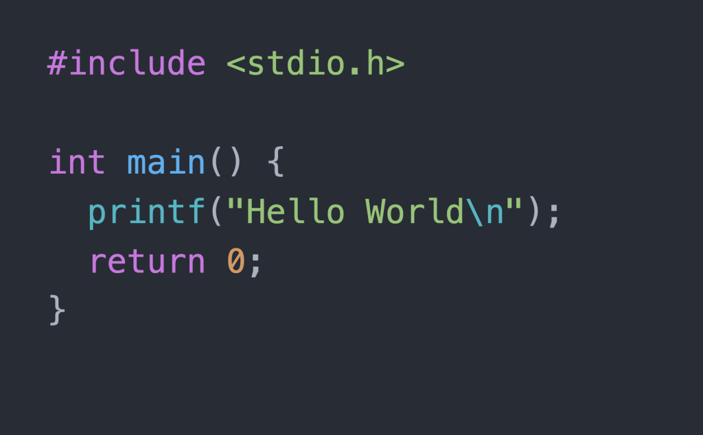

Hello World.

"Hello World."

Its got a similar ring to Neil Armstrong's first words when he walked on the moon :).

And I suppose that's fitting considering what it represents. The <a href="https://en.wikipedia.org/wiki/%22Hello,_World!%22_program" target="_blank">origins</a> of the `Hello World` phenomenon dates all the way back to Brian Kernighan, the programming language - C and Bell Laboratories. Initially used to showcase the power and flexibility of <i>one</i> language and how anything one wanted could be printed on screen, it grew to become a gateway to much much more as an influx of new programmers took their first steps in the age of .com.

In the realm of tech, it was one of the first cultural handshakes that existed in the world of programming besides adding easter eggs to games, using funny variable names and comments and any other quirks that would get past management I imagine. It was a QED, if you will, when one developer had created something to solve a problem faced by many and now wanted to share that with others.

Popularized by tutorial books at the time, it evolved to become, in the era of <a href="https://en.wikipedia.org/wiki/Open-source_software" target="_blank">open-source</a>, the way different companies and individual developers would introduce others to what they had created. And this also became a way to reduce the elitism that existed in the community. By allowing anyone to be able to learn to code, <i>`talent`</i> was no longer contingent upon an educational background from an expensive university or a pre-ordained aptitude with technology. Talent simply became the amount of time it took you from being able to do the `Hello World` project to building something that would add value to the industry.

It goes without saying that today, this phenomen represents an informal welcome to every new person that embarks on a journey to step out of their comfort zone and learn something new. The infrastructure of technology literally rests upon the back of hundreds of millions of people across the world who have each come up with new or improved solutions to numerous different problems that exist. And that has all come together formally and informally to define how we build things now.

And familiarizing oneself with all of that history, to get a sure footing, that first solid step into an unknown world, is no small task. So the next time you feel like skipping over that `Hello World`, don't. But instead, take a deep breath and give that time, in honour and in exchange to the people that have opened their world and hearts to you.

And that concludes my first ever blog post.

   
PS

Developers have some of the best senses of humour.

I suppose having to interact with a machine on a daily basis requires them to maintain one for their own sanity. <a href="https://wiki.c2.com/?FunnyThingsSeenInSourceCodeAndDocumentation" target="_blank">Check out</a> some of the ways they managed to do just that :)
