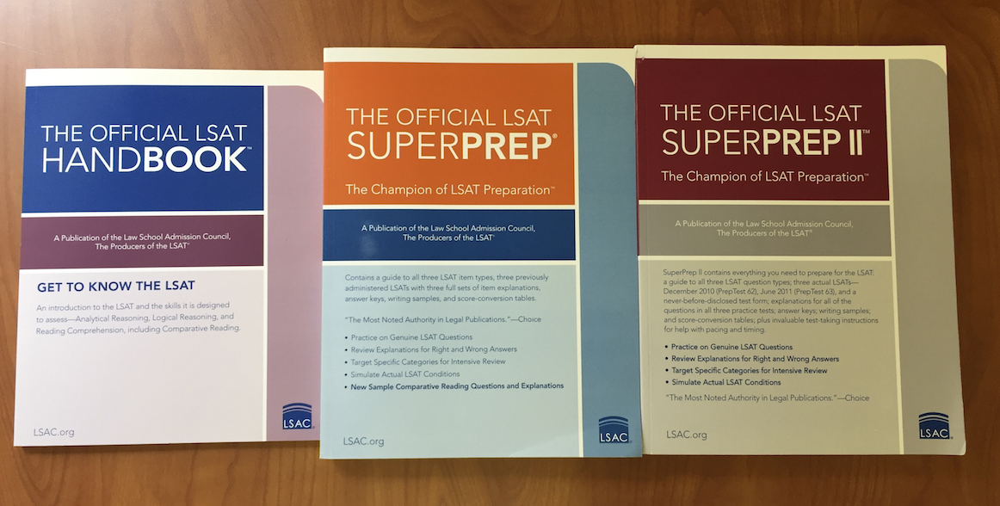

Mastering the LSAT

So you want to go to law school eh? Congratulations, you played yourself.
  

## The Intro

The Law School Admission Test is the gatekeeper to getting into the law school of your choice. Regardless of your major, it is the one test all prospect law students take to give the admissions committee an idea of what kind of candidate you are. Your score represents your ability to do 4-5 tasks in a fixed amount of time. And that is all that it represents. Learn to do those 4-5 tasks and you make a convincing case of why you should get into <i>insert dream law school name here</i>.

The LSAT is arguably less intensive than the MCAT or the SAT. It is a lot more straightforward in its demands and requirements. It focuses on a specific number of topics, each of which complement in learning the other. It summarizes the duties of a legal representative within 4 hours. It is a marathon and a journey. It should be approached with a strategy guided by your self-awareness.

 

## The Administration

Let's briefly go over the administrative aspect of the test. There is a lot of information regarding what the LSAT is, but because its not ordered chronologically, it can be hard to keep track of whats currently relevant.

### The LSAT [pre-2019] (administered in-person on paper):

- 1 <b>scored</b> Analytical Reasoning Section | 4 scenarios with 5-7 questions 
- 1 <b>scored</b> Reading Comprehension Section | 26-28 questions 
- 2 <b>scored</b> Logical Reasoning Sections | 24-26 questions each 
- 1 <b>unscored</b> section from the above three sections used by LSAC to test future questions 
- 1 <b>unscored</b> writing sample to be completed on TEST DAY (seen by law schools) 

### The Digital LSAT [pre-pandemic] (administered in-person on tablets)

- 1 <b>scored</b> Analytical Reasoning Section | 4 scenarios with 5-7 questions 
- 1 <b>scored</b> Reading Comprehension Section | 26-28 questions  
- 2 <b>scored</b> Logical Reasoning Sections | 24-26 questions each  
- 1 <b>unscored</b> section from the above three sections used by LSAC to test future questions 
- 1 <b>unscored</b> writing sample to be completed at your own time and place withing ONE YEAR, although recommended to be completed sooner as it is part of the law school application  

### The LSAT Flex [2020] (administered online through ProctorU - a proctoring software):

- 1 <b>scored</b> Analytical Reasoning Section | 4 scenarios with 5-7 questions 
- 1 <b>scored</b> Reading Comprehension Section | 26-28 questions 
- 1 <b>scored</b> Logical Reasoning Sections | 24-26 questions each 

In light of COVID-19, the LSAT has become more streamlined with only one instance of each section being tested without breaks. The test provides test-takers with the flexibility of taking the test from any location and choosing one of multiple available time slots. The test follows the format of the digital LSAT with the addition of the use of ProctorU - a live proctoring service. You will be monitored throughout the test duration of 2 hours. The test will not have any breaks and you will then have an option to submit a new writing sample within a year.

Take a look at Khan Academy's <a href="https://www.khanacademy.org/test-prep/lsat/lsat-lessons/general-test-information/a/intro-to-the-lsat" target="_blank">A brief introduction to the LSAT</a> to get a more detailed overview of each section, a resource I will be recommending heavily for your prep.

 

## The Prep

### A necessary evil

This is where your the majority of your focus will be. Not a great test-taker? No problem. Hate exams? No problem. On the other hand, enjoy puzzles? Great! Hate logic puzzles? No problem. The journey of a 1000 miles begins with a single step. The LSAT is a mandatory part of the process, a necessary evil or game that you need to play and overcome to get into law school. You need to somehow convince yourself that this step is just that, <i>a step</i>, and that you _can_ and _will_ do this. Because the truth is YOU _can_. Unlike standardized tests, the Law School Administration Test tests your capability in a given set of skills. You do not need to be the best at a wide range of topics, you only need to master a few and you are guaranteed to see those questions on the LSAT.

### No surprises

There will be no surprises on the LSAT. What you use to prepare with is more or less what you will get. Your challenge is <b><i>not</i></b> to anticipate all the questions that can potentially show up. Your challenge is <b><i>not</i></b> to memorize and have a working vocabulary of over 5000 words (although these things can give you an advantage -- the advantage they provide are situational and minimal and so this will not be your focus). Your challenge, however, <b><i>is</i></b> to be efficient with time. And your challenge definitely <b><i>is</i></b> to become efficient at interpreting and tackling the question with time to spare. The quicker you are at answering every single question correctly, the better your score will be.

### Maximize Correctness : Time Ratio

The LSAT's difficulty does not stem from the challenge of the problem like Euclid Math Contests, it stems from the fact there is only so much time you can dedicate per question. Once you understand the mechanics behind each type of question, your only metric will be time.

How many questions can you get <b>correct</b> in a given amount of time?  
How long can you <B>maintain your focus</b> for when you are tackling a 2 hour exam and reading filtering/sorting/compartmentalizing/analyzing all sorts of information?  
How much time are you spending on the <b>easy</b> questions?  
How much time are you spending on the <b>hard</b> questions?  
How much time are you spending <b>reading</b> and <b>understanding</b> the comprehension sections?  
How <b>accurate</b> is your <b>retention</b> of the comprehension section?  

### Prep Materials

#### 1. <a href="https://www.khanacademy.org/prep/lsat" target="_blank">Khan Academy's LSAT Prep</a> (Highly Recommended)

The is the <b>only resource you need</b> from the list. Khan Academy's LSAT Prep is extremely well-structured. It walks you through excercises, paces you up to take more complex questions in the same category, offers you the option to take upto 10 complete practice tests and provides you with around 300-400 unique excercises.

It keeps track of your scores for all the practice tests and excercises it offers. It gives you the option to select a study plan that offers up to 10 unique past tests for you to take like the real deal. It offers you flexibility on the scheduling of these practice tests. It helps yous set a desired score and tailors the set of excercises based on your current performance. There is no way for me to convince of you this other than saying go <a href="https://www.khanacademy.org/prep/lsat/intro" target="_blank">sign up</a> for it.

#### 2. <a href="http://www.thelsattrainer.com/" target="_blank">The LSAT Trainer - <i>Mike Kim</i></a> (Optional) 

#### 3. <a href="https://www.lsac.org/lsat/lsat-prep/prep-books-ebooks/10-actual-official-lsat-prepteststm" target="_blank">10 LSAC Official PrepTests</a> 

<b>NOTE: I ABSOLUTELY DO NOT RECOMMEND SPLURGING MONEY ON PREP BOOKS/COURSES BY KAPLAN, PRINCETON, MANHATTAN PREP, ETC. THESE BOOKS AND COURSES ARE WORDY, EXPENSIVE AND COMPLETELY UNNECESSARY. THERE IS NOTHING THEY HAVE TO OFFER WHICH YOU CANNOT ACCESS OR DO BY YOURSELF.</b>

### Take the Diagnostic ASAP

There is no better way to get started other than getting started. Your first priority is to take the diagnostic test. Delaying the inevitable is not going to make you better at the LSAT. Familiarize yourself with your strengths and shortcomings.

The diagnostic test is a shorter version of the LSAT testing your performance in each category. This will be the first of many completely zoned-in, crunch time, time commitments that you will make, so get used to it.

