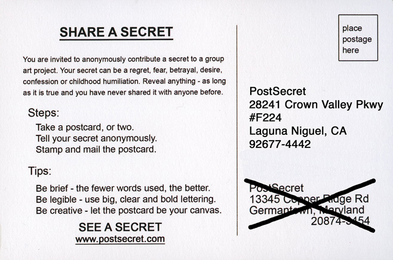

Post Secret.

I'd like to share a secret with you.

In fact, I would like to share many secrets with you.

I would like to share the most intimate secrets of thousands of people who have chosen to reveal them to me and now to you.

I do not know their names and neither will you. But, you will know a piece of their heart. You will see the light they carry along with the dark.

You will enter a place without judgement. A place where remorse and gratitude exist unanimously, where hope and sorrow are bound eternally, where the claws of the past latch onto the present, and where spirit and soul are unbounded, unhindered. A place free of physical and social constructs, a place where only thought and emotion reign, a place where a soul can simply be.

I would like to share with you a window that a friend of mine shared with me a long time ago. A window that peeks at these very souls; as part of an effort to provide them and us with healing, relief and moments of reflection.

I <a href="https://postsecret.com/" target="_blank">hope you find</a> what _we_ did :)
